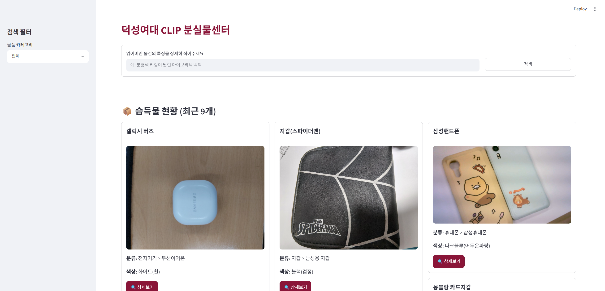
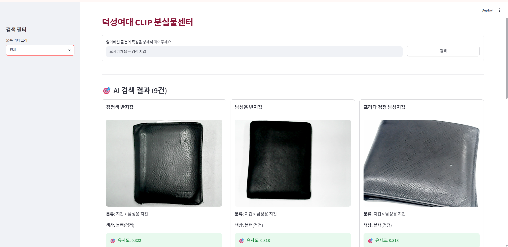
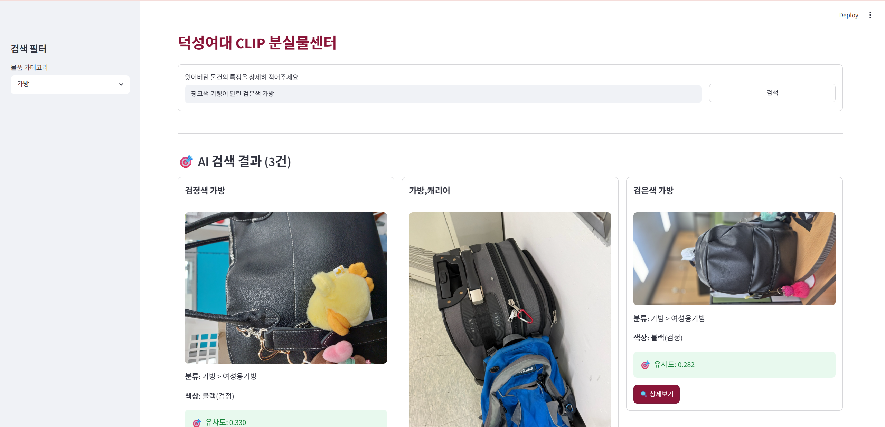
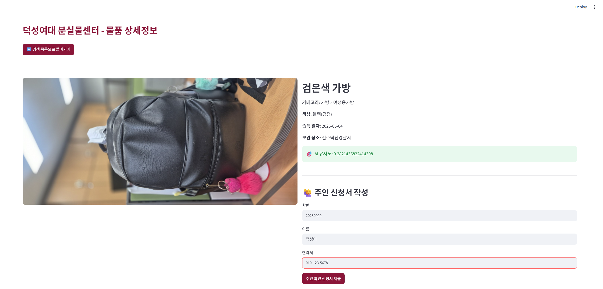
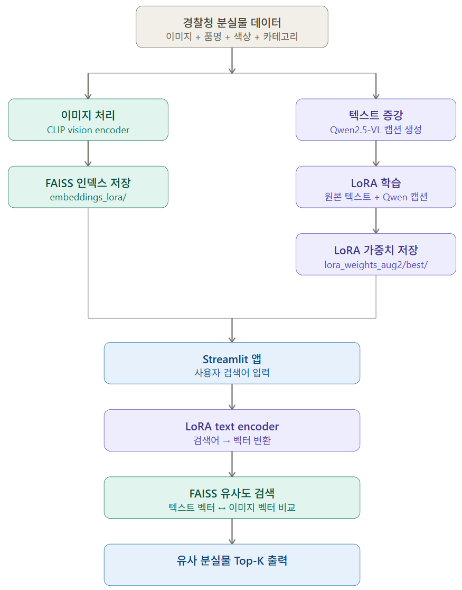

# 🎒 Clipback

특징만으로 찾는 AI 분실물 검색 플랫폼

## 프로젝트 소개

물건을 잃어버렸을 때 가장 어려운 일은 **기억하는 특징을 그대로 검색할 수 없다는 점**입니다.

기존 분실물 검색 시스템은 분류, 색상, 지역, 키워드와 같은 제한적인 조건을 기반으로 검색하기 때문에 사용자는 기억나는 특징을 일일이 검색 조건으로 바꿔 입력해야 합니다.

Clipback은 이러한 불편함을 해결하기 위해 개발된 AI 기반 분실물 검색 시스템입니다. 사용자가 "모서리가 닳은 검은색 반지갑"처럼 자연스럽게 설명하면, AI가 문장의 의미를 이해하여 가장 유사한 습득물을 찾아줍니다.

본 프로젝트는 캠퍼스 분실물 검색 시스템을 목표로 설계되었으며, 시연 및 성능 검증을 위해 경찰청 공개 습득물 데이터를 활용하여 구현했습니다. 동일한 구조를 기반으로 학교, 지하철, 기업 등 다양한 분실물 관리 시스템으로 확장할 수 있습니다.
 
### 핵심 기술
- **한국어 CLIP** (`Bingsu/clip-vit-large-patch14-ko`): 텍스트-이미지 유사도 측정
- **LoRA fine-tuning**: 경찰청 분실물 도메인에 맞게 text encoder 최적화
- **Qwen2.5-VL 데이터 증강**: 이미지 캡셔닝으로 학습 텍스트 다양화
- **FAISS**: 고속 벡터 유사도 검색
- **Streamlit**: 웹 UI

### 실행 화면

#### 메인 화면


#### 검색 결과


#### 카테고리 필터 + 검색


#### 물품 상세정보 및 주인 신청


## 개발 환경

- Python 3.12
- CUDA 12.8 / RTX 4070
- Windows 11 / Ubuntu 22.04

## 설치 및 실행

### 1. 저장소 클론
 
```bash
git clone https://github.com/jamie0312/Clipback.git
cd Clipback
```

### 2. 패키지 설치

```bash
pip install -r requirements.txt

# CUDA 환경에서 더 빠른 실행을 원한다면
pip install torch torchvision --index-url https://download.pytorch.org/whl/cu128
```

### 3. 앱 실행
```bash
streamlit run app.py
```

## 데이터 파이프라인


## 직접 구축하기
> 이미 학습된 가중치와 인덱스가 포함되어 있으므로 `streamlit run app.py`만으로 바로 실행 가능합니다.
> 처음부터 직접 구축하려면 아래 순서로 실행하세요.
```bash
# 1. .env 파일에 API 키 입력(데이터 수집 시에만 필요)

# 2. 경찰청 API에서 분실물 데이터 수집
python scripts/fetch_data.py
 
# 3. 이미지 로컬 저장
python scripts/download_images.py
 
# 4. Baseline FAISS 인덱스 구축
python scripts/build_index_baseline.py
 
# 5. (선택) Qwen 데이터 증강 - GPU 서버 필요
pip install -r requirements_augment.txt
python scripts/augment_qwen.py
 
# 6. LoRA 학습
python scripts/train_lora_augmented.py   # 증강 데이터 사용 (권장)
# python scripts/train_lora.py           # 증강 없이
 
# 7. LoRA FAISS 인덱스 구축
python scripts/build_index_lora.py
 
# 8. 성능 평가
python eval.py --mode all
```

### 사전 학습된 파일
 
| 파일 | 설명 | 링크 |
|---|---|---|
| `lora_weights_aug/` | LoRA 가중치 (최종) | GitHub에 포함 |
| `embeddings_lora/` | FAISS 인덱스 | GitHub에 포함 |
| `data/items.json` | 분실물 메타데이터 | GitHub에 포함 |
| `data/images/` | 분실물 이미지 1336개 | 별도 다운로드 필요 |
 
> 이미지 파일은 용량 문제로 GitHub에 포함되지 않으며, `streamlit run app.py` 실행에는 불필요합니다.
> 학습 및 인덱스 재구축 시에는 [Google Drive](https://drive.google.com/file/d/1SxPBa_P890Lfh4PImCdbWQFDc34jBXdK/view?usp=sharing)에서 다운로드 후 `data/images/`에 저장하거나, `scripts/download_images.py`를 실행하세요.

## 팀원별 역할 분담
 
| 이름 | 역할 |
|---|---|
| 김재희 | 데이터 수집, Streamlit UI 설계 및 연동, Baseline 모델 구현, fine-tuned CLIP 모델 구현, 최종 보고서 작성 |
| 김성희 | 데이터 전처리 및 증강, Baseline 모델 구현, LoRA fine-tuning, 성능 평가, README.md 작성 |